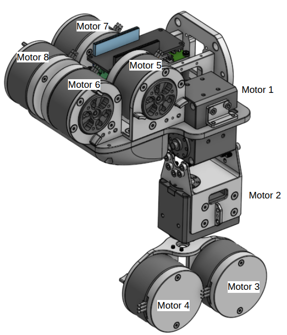

## Software Installation

### PCAN Installation

#### 1. Install PCAN Driver

If you are using Linux environments missing a driver (e.g. minimized Linux environments, older kernels) or you want to use our character-based driver (chardev) e.g. in connection with the PCAN-Basic API, you need our [PCAN-Linux driver package](https://www.peak-system.com/fileadmin/media/linux/index.php#Section_Driver-Proproetary) and compile the driver yourself.

Download `peak-linux-driver-8.18.0.tar.gz` (or other updated version).

[PCAN Driver Manual](https://www.peak-system.com/fileadmin/media/linux/files/PCAN-Driver-Linux_UserMan_eng.pdf)

Extract
```
tar -xzvf peak-linux-driver-8.18.0.tar.gz`
```

`cd` Into the directory and make clean

```
cd peak-linux-driver-8.18.0
make clean
```

Install dependency
```
sudo apt-get install libelf-dev 

sudo apt-get install libpopt-dev
```

make and install 

```
make clean
make
sudo make install
```

> If you get an error with gcc-11, use gcc-12 instead.
>```
>make clean
>make CC=gcc-12
>sudo make install
>```


> [!NOTE] Using PCAN with SocketCAN
> `make` command builds with `chardev` which is used by PCAN Basic Interface API (such as PCAN Python API). To use the device with SocketCAN which is natively supported without the driver installation, you need to re-build with `netdev`
> ```
> make -C driver NET=NETDEV_SUPPORT


#### 2. Install PCAN-Basic API

[Download PCAN-Basic API (Linux)](https://www.peak-system.com/PCAN-Basic.239.0.html?&L=1)

Extract and `cd` into the directory
```
tar -xzvf PCAN-Basic_Linux-4.8.0.5.tar.gz
cd PCAN-Basic_Linux-4.8.0.5/libpcanbasic/pcanbasic/
```

Make and install
```
make clean
make
sudo make install
```

Being a module, the driver, however, can be loaded without rebooting the system by asking the system to probe for the PCAN module
```
sudo modprobe pcan
```

### ROS 2 Installation

This package supports ROS 2 Jazzy with Ubuntu 24.04 and ROS 2 Humble with
Ubuntu 22.04. Follow the [ROS 2 Jazzy Installation Guide](https://docs.ros.org/en/jazzy/Installation/Ubuntu-Install-Debs.html)
or the [ROS 2 Humble Installation Guide](https://docs.ros.org/en/humble/Installation/Ubuntu-Install-Debs.html).

#### ROS 2 Dependencies

Install the dependencies declared by this checkout with `rosdep` from the
workspace root. For ROS 2 Jazzy on Ubuntu 24.04:

```bash
cd ~/workspaces/plato_ws
source /opt/ros/jazzy/setup.bash

# Run once per machine if rosdep has not been initialized yet.
if [ ! -f /etc/ros/rosdep/sources.list.d/20-default.list ]; then
  sudo rosdep init
fi

rosdep update
rosdep install --from-paths src/PLATO_ROS --ignore-src --rosdistro jazzy -r -y
```

For ROS 2 Humble on Ubuntu 22.04, source `/opt/ros/humble/setup.bash` and
replace `jazzy` with `humble` in the `rosdep install` command.

`rosdep` installs ROS/system dependencies but does not build the workspace or
install PEAK's proprietary PCAN-Basic API. The PCAN-Basic prerequisite is
described above and is still required by the current shared CAN library,
including when the runtime backend is SocketCAN.

#### Eigen Installation
We use Eigen3 for matrix operations. Install [Eigen3](https://eigen.tuxfamily.org/dox/GettingStarted.html)with you preferred method.
I used apt to install Eigen3.
```
sudo apt install libeigen3-dev
```

## Motor Configuration

There are two types of motors used: Steadywin GIM3505-8 and Dynamixel XM430-W350-T. Each GIM3505 has an on-axis motor driver which communicates via CAN. OpenRB150 and Aruino CAN Shield communicate via CAN and convert commands and motor information to TTL which dynamixel motors use. Each motor has two unique CAN IDs to identify them in context of TX and RX. The CAN IDs for each motor follows:



**Motor CAN ID:**
- MOTOR1: 0x0a (10)
- MOTOR2: 0x0b (11)
- MOTOR3: 0x0c (12)
- MOTOR4: 0x0d (13)
- MOTOR5: 0x0e (14)
- MOTOR6: 0x0f (15)
- MOTOR7: 0x10 (16)
- MOTOR8: 0x11 (17)

TX ID and RX ID for each motor is same
