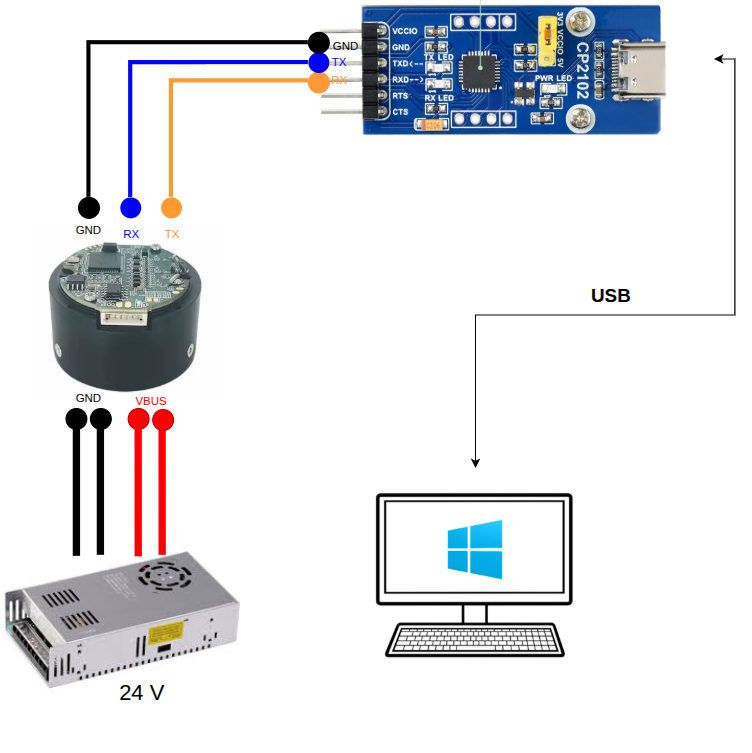

## Software Installation


### PCAN Installation

#### 1. Install PCAN Driver

If you are using Linux environments missing a driver (e.g. minimized Linux environments, older kernels) or you want to use our character-based driver (chardev) e.g. in connection with the PCAN-Basic API, you need our [PCAN-Linux driver package](https://www.peak-system.com/fileadmin/media/linux/index.php#Section_Driver-Proproetary) and compile the driver yourself.

Download `peak-linux-driver-8.18.0.tar.gz` (or other updated version).

[PCAN Driver Manual](https://www.peak-system.com/fileadmin/media/linux/files/PCAN-Driver-Linux_UserMan_eng.pdf)

Extract
```
tar -xzvf peak-linux-driver-8.18.0.tar.gz`
```

`cd` Into the directory and make clean

```
cd peak-linux-driver-8.18.0
make clean
```

Install dependency
```
sudo apt-get install libelf-dev sudo apt-get install libpopt-dev
```

make and install 

```
make clean
make
sudo make install
```

> If you get an error with gcc-11, use gcc-12 instead.
>```
>make clean
>make CC=gcc-12
>sudo make install
>```


> [!NOTE] Using PCAN with SocketCAN
> `make` command builds with `chardev` which is used by PCAN Basic Interface API (such as PCAN Python API). To use the device with SocketCAN which is natively supported without the driver installation, you need to re-build with `netdev`
> ```
> make -C driver NET=NETDEV_SUPPORT


#### 2. Install PCAN-Basic API

[Download PCAN-Basic API (Linux)](https://www.peak-system.com/PCAN-Basic.239.0.html?&L=1)

Extract and `cd` into the directory
```
tar -xzvf PCAN-Basic_Linux-4.8.0.5.tar.gz
cd PCAN-Basic_Linux-4.8.0.5/libpcanbasic/pcanbasic/
```

Make and install
```
make clean
make
sudo make install
```

Being a module, the driver, however, can be loaded without rebooting the system by asking the system to probe for the PCAN module
```
sudo modprobe pcan
```

### ROS 2 Installation

This package uses ros `humble` distribution with Ubuntu 22.04. To install, follow the instructions on the [ROS 2 Humble Installation Guide](https://docs.ros.org/en/humble/Installation/Ubuntu-Install-Debs.html).

#### ROS 2 Depedencies

TODO: Use Rosdep to install dependencies
TODO: Add a build check for ROS 2

```
sudo apt install ros-humble-hardware-interface ros-humble-can-msgs ros-humble-xacro ros-humble-joint-state-publisher-gui ros-humble-controller-manager ros-humble-joint-state-broadcaster ros-humble-position-controllers

```

#### Eigen Installation
We use Eigen3 for matrix operations. Install [Eigen3](https://eigen.tuxfamily.org/dox/GettingStarted.html)with you preferred method.
I used apt to install Eigen3.
```
sudo apt install libeigen3-dev
```

## Motor Configuration
The GIM3505 Actuators are configured using [Steadywin Motor Wizard](https://steadywin.cn/en/col.jsp?id=124) which runs on Windows (We tested on Windows 10 and Windows 11) and CP2102 USB to UART Bridge which comes with GIM3505. GIM3505 can be configured via CAN, but I do not recommend it since Motor Wizard provide GUI to configure the motor parameters easily.

> Warning: The CP20102 Board outputs voltage via VCCIO pin (either 3.3V or 5 V depending on the yellow jumper wire location) which may increase the chance of shorting the board if not careful. To prevent this, you can remove the yellow jumper wire to disable voltage output pin from the CP2102 board.


Refer to the [GIM3505 Driver Drawing](https://14180476.s21i.faiusr.com/61/ABUIABA9GAAgkfLvpAYoz6y4oAU.pdf) for the detail pinout.


