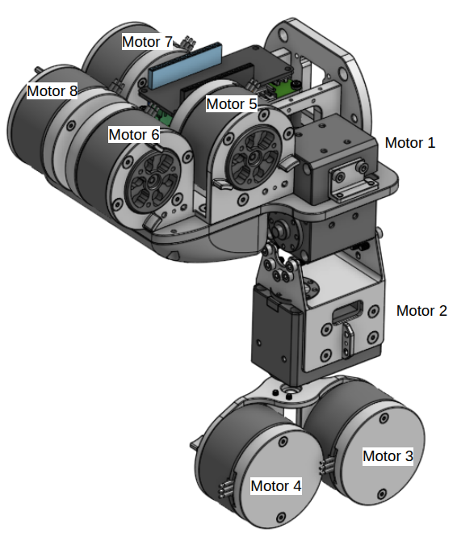
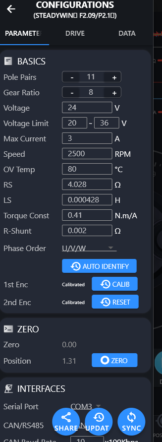

## Software Installation


### PCAN Installation

#### 1. Install PCAN Driver

If you are using Linux environments missing a driver (e.g. minimized Linux environments, older kernels) or you want to use our character-based driver (chardev) e.g. in connection with the PCAN-Basic API, you need our [PCAN-Linux driver package](https://www.peak-system.com/fileadmin/media/linux/index.php#Section_Driver-Proproetary) and compile the driver yourself.

Download `peak-linux-driver-8.18.0.tar.gz` (or other updated version).

[PCAN Driver Manual](https://www.peak-system.com/fileadmin/media/linux/files/PCAN-Driver-Linux_UserMan_eng.pdf)

Extract
```
tar -xzvf peak-linux-driver-8.18.0.tar.gz`
```

`cd` Into the directory and make clean

```
cd peak-linux-driver-8.18.0
make clean
```

Install dependency
```
sudo apt-get install libelf-dev sudo apt-get install libpopt-dev
```

make and install 

```
make clean
make
sudo make install
```

> If you get an error with gcc-11, use gcc-12 instead.
>```
>make clean
>make CC=gcc-12
>sudo make install
>```


> [!NOTE] Using PCAN with SocketCAN
> `make` command builds with `chardev` which is used by PCAN Basic Interface API (such as PCAN Python API). To use the device with SocketCAN which is natively supported without the driver installation, you need to re-build with `netdev`
> ```
> make -C driver NET=NETDEV_SUPPORT


#### 2. Install PCAN-Basic API

[Download PCAN-Basic API (Linux)](https://www.peak-system.com/PCAN-Basic.239.0.html?&L=1)

Extract and `cd` into the directory
```
tar -xzvf PCAN-Basic_Linux-4.8.0.5.tar.gz
cd PCAN-Basic_Linux-4.8.0.5/libpcanbasic/pcanbasic/
```

Make and install
```
make clean
make
sudo make install
```

Being a module, the driver, however, can be loaded without rebooting the system by asking the system to probe for the PCAN module
```
sudo modprobe pcan
```

### ROS 2 Installation

This package uses ros `humble` distribution with Ubuntu 22.04. To install, follow the instructions on the [ROS 2 Humble Installation Guide](https://docs.ros.org/en/humble/Installation/Ubuntu-Install-Debs.html).

#### ROS 2 Depedencies

TODO: Use Rosdep to install dependencies
TODO: Add a build check for ROS 2

```
sudo apt install ros-humble-hardware-interface ros-humble-can-msgs ros-humble-xacro ros-humble-joint-state-publisher-gui ros-humble-controller-manager ros-humble-joint-state-broadcaster ros-humble-position-controllers

```

#### Eigen Installation
We use Eigen3 for matrix operations. Install [Eigen3](https://eigen.tuxfamily.org/dox/GettingStarted.html)with you preferred method.
I used apt to install Eigen3.
```
sudo apt install libeigen3-dev
```


## Motor Configuration

There are two types of motors used: Steadywin GIM3505-8 and Dynamixel XM430-W350-T. Each GIM3505 has an on-axis motor driver which communicates via CAN. OpenRB150 and Aruino CAN Shield communicate via CAN and convert commands and motor information to TTL which dynamixel motors use. Each motor has two unique CAN IDs to identify them in context of TX and RX. The CAN IDs for each motor follows:



**MotorTxID:**
- MOTOR1: 0x11 (17)
- MOTOR2: 0x12 (18)
- MOTOR3: 0x13 (19)
- MOTOR4: 0x14 (20)
- MOTOR5: 0x15 (21)
- MOTOR6: 0x16 (22)
- MOTOR7: 0x17 (23)
- MOTOR8: 0x18 (24)

**MotorRxID:**
- MOTOR1: 0x21 (33)
- MOTOR2: 0x22 (34)
- MOTOR3: 0x23 (35)
- MOTOR4: 0x24 (36)
- MOTOR5: 0x25 (37)
- MOTOR6: 0x26 (38)
- MOTOR7: 0x27 (39)
- MOTOR8: 0x28 (40)

For consistency, I will refer to all CAN IDs in hexadecimal format in the rest of the document while their decimal values are in parentheses.


### GIM3505 Configuration
The GIM3505 Actuators are configured using [Steadywin Motor Wizard](https://steadywin.cn/en/col.jsp?id=124) which runs on Windows (We tested on Windows 10 and Windows 11) and CP2102 USB to UART Bridge which comes with GIM3505. GIM3505 can be configured via CAN, but I do not recommend it since Motor Wizard provide GUI to configure the motor parameters easily.

> Warning: The CP20102 Board outputs voltage via VCCIO pin (either 3.3V or 5 V depending on the yellow jumper wire location) which may increase the chance of shorting the board if not careful. To prevent this, you can remove the yellow jumper wire to disable voltage output pin from the CP2102 board.

#### 1. Connect CP2102 to GIM3505 and PC


Refer to the [GIM3505 Driver Drawing](https://14180476.s21i.faiusr.com/61/ABUIABA9GAAgkfLvpAYoz6y4oAU.pdf) for the detail pinout.


#### 2. Identify the phase order and calibrate the encoder
Click `AUTO IDENFITY` button and then calibrate 1st Encoder by clikcing `CALIB` button.

#### 3. Configure the motor parameters
Once you launch the Motor Wizard, you can confugre the motor with the following parameters:



In the interfaces section, select `CAN` as the communication type with `CyberBeast` protocol. I have not tested MIT CAN protocol, and the ros2_control hardware interface was written for CyberBeast protocol. You can see the detail CAN protocol [here](https://14180476.s21i.faiusr.com/61/ABUIABA9GAAgqPvVqgYo-uLA7Ac.pdf?v=1708485774)
Set the CAN baud rate as `10` x 100 Kbps (1 Mbps). 


**Make sure to disable the motor to flash the parameters.**
Clicking the `UPDATE` button will write the parameters to the motor. To ensure the parameters are properly written, click `SYNC` to retrive and see the current parameters from the motor.


## Dynamixel Configuration

We can configure Dynamixels using Arduino IDE or Dynamixel Wizard. I have configured my Dynamixel motors using Arduino IDE because I could not run Dynamixel Wizard on my Linux machine, but I recommend using Dynamixel Wizard for ease of use.


#### 1. Configure Dynamixel baudrate and IDs (Arduino IDE)

If you are using Arduino IDE, you can look at the [Dynamixel2Arduino](https://github.com/ROBOTIS-GIT/Dynamixel2Arduino/tree/master/examples/basic) example codes to configure Baudrate and IDs of the motors. Note these IDs are not CAN IDs, but Dynamixel IDs which are used to identify the motors in the Dynamixel network.

#### 2. Flash the firmware for Dynamixel motors

The Arduino firmware for Dynamixel motors can be found [here](https://github.com/dokkev/sony_plato/tree/main/firmware/plato2_dynamixel_CAN), and you can flash the firmware using Arduino IDE. This firmware is used to convert the CAN commands from OpenRB150 to Dynamixel commands. The firmware uses the `Dynamixel2Arduino` library to communicate with Dynamixel motors.
